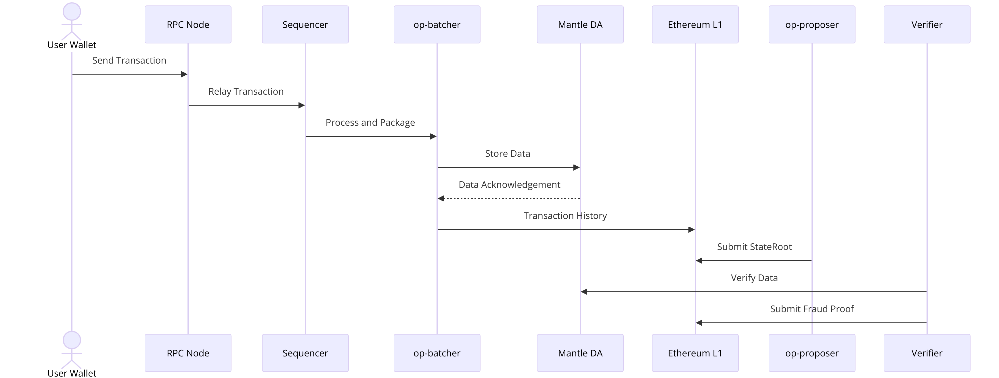

# Mantle 核心模块及整体工作流程

以下是 Mantle 网络的所有关键模块及其功能的完整总结，结合之前的内容和最新章节的验证机制：

1. Mantle 核心模块

1.1 用户层

	1.	用户钱包：
	•	功能：用户通过数字钱包与 Mantle 网络交互。
	•	职责：
	•	提供交易发起和接收界面。
	•	与 RPC 节点通信，发起转账请求。
	•	查询余额（通过 RPC 或爬块程序）。

1.2 Mantle Layer 2

	2.	RPC 节点：
	•	功能：Mantle 网络的入口，连接用户钱包与 Mantle 网络。
	•	职责：
	•	接收用户发送的交易请求。
	•	转发交易请求到 Sequencer（排序器）。
	3.	Sequencer（排序器）：
	•	功能：对接收到的交易进行排序和打包。
	•	职责：
	•	确保交易的顺序一致性。
	•	将多个交易打包为区块，减少提交到 L1 的负担。
	•	子组件：
	•	op-node：处理区块的传递和验证。
	•	op-geth：执行区块中的交易并存储数据。
	4.	op-batcher：
	•	功能：负责交易历史的压缩和提交。
	•	职责：
	•	从 Sequencer 获取区块数据。
	•	压缩区块中的交易历史，提交到：
	•	Mantle DA（数据可用性层），存储完整数据。
	•	以太坊 L1，提交压缩后的交易历史。
	5.	op-proposer：
	•	功能：计算和提交状态根。
	•	职责：
	•	根据区块和交易计算新的状态根（StateRoot）。
	•	提交状态根到以太坊 L1，确保 L1 和 L2 的状态同步。
	6.	Mantle DA（数据可用性层）：
	•	功能：存储交易数据和区块信息，确保数据可用性。
	•	职责：
	•	提供完整的 Rollup 数据供 Verifier 使用。
	•	在 Layer 2 出现争议时，支持状态重建。
	7.	Verifier（验证者）：
	•	功能：维护 Layer 2 的数据完整性。
	•	职责：
	•	从 Mantle DA 同步 Rollup 数据。
	•	检查 op-proposer 提交的状态根是否与 Layer 1 的记录一致。
	•	发现错误时生成 Fraud Proof，提交到 Layer 1。
	•	子组件：
	•	op-node：同步数据状态并进行初步验证。
	•	op-geth：对区块执行交易，检查状态一致性。

1.3 Ethereum Layer 1

	8.	以太坊 L1：
	•	功能：作为 Mantle 的安全锚点，存储交易数据和状态根。
	•	职责：
	•	接收 op-batcher 提交的压缩交易历史。
	•	接收 op-proposer 提交的状态根。
	•	验证 Fraud Proof，仲裁 Layer 2 的数据争议。

2. Mantle 的整体工作流程

2.1 交易发起

	1.	用户通过数字钱包发起交易：
	•	钱包与 RPC 节点通信，提交转账请求。
	2.	RPC 节点将请求转发给 Sequencer。

2.2 交易处理

	3.	Sequencer 处理交易：
	•	对交易进行排序，确保一致性。
	•	将多个交易打包为区块。
	4.	Sequencer 生成区块后，将其传递给：
	•	op-batcher：处理交易历史。
	•	op-proposer：处理状态根。

2.3 数据传输与提交

	5.	op-batcher 的操作：
	•	压缩交易历史，分别提交到 Mantle DA 和以太坊 L1。
	6.	op-proposer 的操作：
	•	计算区块的状态根并提交到以太坊 L1，保持 L1 和 L2 的状态同步。

2.4 数据验证

	7.	Verifier 的验证：
	•	Verifier 从 Mantle DA 提取 Rollup 数据。
	•	检查 op-proposer 提交的状态根是否与 Layer 1 数据匹配。
	8.	争议处理：
	•	如果发现错误，Verifier 提交 Fraud Proof 至以太坊 L1。
	•	Layer 1 智能合约验证 Fraud Proof，并根据验证结果处理数据。

3. Mantle 验证机制的优点

    1. 多层安全保障：
       • op-proposer 提交状态根提供第一层保护。
       • Verifier 验证机制提供第二层保护。
       • Fraud Proof 机制通过 Layer 1 提供最终保障。
    2. 去中心化与透明性：
       • Verifier 由多个独立节点组成，确保验证过程去中心化。
       • Layer 1 仲裁为系统提供透明性和可信性。
    3. 容错能力：
       • 即使 Layer 2 出现错误，Fraud Proof 机制能够通过 Layer 1 恢复系统状态。
    4. 用户信任：
       • 对用户而言，验证机制增强了对交易处理结果的信任。

4. Mantle 数据流图整合

以下是 Mantle 数据流的完整描述，结合验证机制：

User Wallet --> RPC Node --> Sequencer --> op-batcher --> Mantle DA
--> op-batcher --> Ethereum L1 (Transaction History)
--> op-proposer --> Ethereum L1 (StateRoot)
Verifier --> Mantle DA
Verifier --> Ethereum L1 (Fraud Proof)

5. 总结

Mantle 网络通过模块化设计实现了高效性和安全性的平衡：
• Sequencer 提高交易处理速度，降低用户成本。
• op-batcher 和 op-proposer 保证 Layer 2 和 Layer 1 的数据同步。
• Verifier 和 Fraud Proof 提供最终验证和争议解决。

这种架构为用户提供了快速、低成本且可信的区块链体验，同时确保了系统的完整性和安全性。